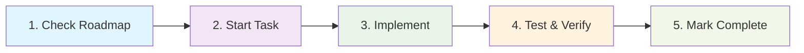
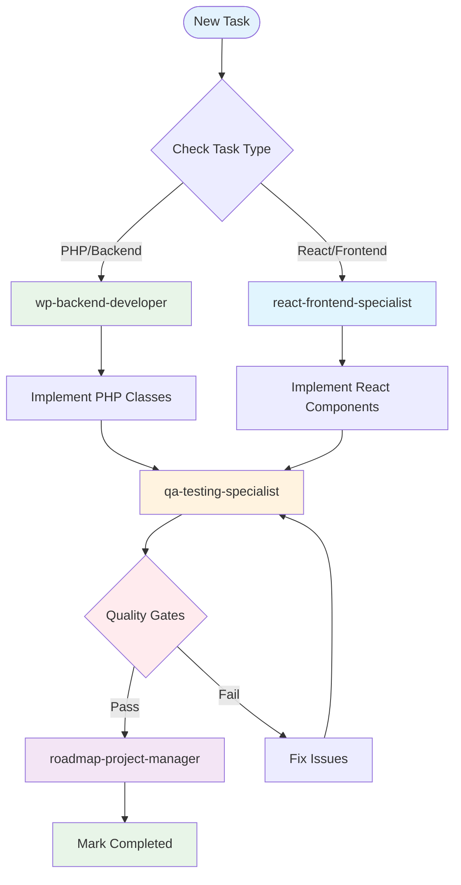

# 🚀 Woo AI Assistant - Development Guide

## 📋 Table of Contents

1. [Quick Start](#quick-start)
2. [Development Environment Setup](#development-environment-setup)
3. [Project Workflow](#project-workflow)
4. [Task Implementation Guide](#task-implementation-guide)
5. [Testing Your Code](#testing-your-code)
6. [Common Issues & Solutions](#common-issues--solutions)
7. [Best Practices](#best-practices)

---

## 🎯 Quick Start

### Prerequisites Checklist
- [ ] macOS with MAMP installed
- [ ] PHP 8.2+ configured in MAMP
- [ ] Node.js 18+ and npm installed
- [ ] Composer installed globally
- [ ] Git configured
- [ ] VS Code or PhpStorm IDE
- [ ] WordPress 6.0+ installed in MAMP
- [ ] WooCommerce 7.0+ activated

### 30-Second Setup
```bash
# 1. Clone the repository
cd /Applications/MAMP/htdocs/wp/wp-content/plugins/
git clone [repository-url] woo-ai-assistant
cd woo-ai-assistant

# 2. Copy environment configuration
cp .env.example .env
# Edit .env with your API keys

# 3. Install dependencies
composer install
npm install

# 4. Activate the plugin
wp plugin activate woo-ai-assistant
# Or activate via WordPress admin
```

---

## 🛠 Development Environment Setup

### Step 1: MAMP Configuration

#### 1.1 Configure PHP
```
MAMP > Preferences > PHP
- Select PHP 8.2.20
- Apply & Restart Servers
```

#### 1.2 Configure Ports
```
MAMP > Preferences > Ports
- Apache Port: 8888
- MySQL Port: 8889
- Apply
```

#### 1.3 Set Document Root
```
MAMP > Preferences > Web Server
- Document Root: /Applications/MAMP/htdocs
```

### Step 2: WordPress Setup

#### 2.1 Access WordPress
```
http://localhost:8888/wp
```

#### 2.2 Enable Debug Mode
Edit `/Applications/MAMP/htdocs/wp/wp-config.php`:
```php
define('WP_DEBUG', true);
define('WP_DEBUG_LOG', true);
define('WP_DEBUG_DISPLAY', false);
define('SCRIPT_DEBUG', true);

// Woo AI Assistant specific
define('WOO_AI_ASSISTANT_DEBUG', true);
define('WOO_AI_ASSISTANT_USE_DUMMY_DATA', true);
```

### Step 3: API Keys Configuration

#### 3.1 Create .env file
```bash
cp .env.example .env
```

#### 3.2 Add your development API keys
```env
# Essential keys for development
OPENROUTER_API_KEY=sk-or-v1-your-key-here
OPENAI_API_KEY=sk-your-key-here
PINECONE_API_KEY=your-key-here

# Enable development mode
WOO_AI_DEVELOPMENT_MODE=true
```

⚠️ **IMPORTANT:** Never commit .env file with real keys!

### Step 4: Install Dependencies

#### 4.1 PHP Dependencies
```bash
composer install
composer dump-autoload -o  # Optimize autoloader
```

#### 4.2 Node Dependencies
```bash
npm install
```

### Step 5: Build Assets

#### 5.1 Development Build (with watching)
```bash
npm run watch
```

#### 5.2 Production Build
```bash
npm run build
```

---

## 📋 Project Workflow

### Understanding the Roadmap System

This project uses a **strict roadmap-driven development** approach:

1. **ALWAYS** check `ROADMAP.md` before starting work
2. **NEVER** skip task dependencies
3. **ALWAYS** run quality gates before marking tasks complete

### The 5-Step Task Workflow



### 🎯 Specialized Agents Workflow Diagram



### 🤖 CRITICAL: Specialized Agents Workflow

This project requires using **specialized AI agents** for different types of work:

#### Agent Selection Rules:
- **wp-backend-developer** 🔧 - For PHP classes, database, WordPress/WooCommerce hooks
- **react-frontend-specialist** ⚛️ - For React components, JavaScript, widget frontend
- **qa-testing-specialist** ✅ - MANDATORY before completing ANY task
- **roadmap-project-manager** 📋 - For task status updates, progress tracking

#### Mandatory Workflow Sequence:
```
1. 📋 roadmap-project-manager - Mark task as "in_progress"
2. 🔧 wp-backend-developer OR ⚛️ react-frontend-specialist - Implement
3. ✅ qa-testing-specialist - Run quality gates (MANDATORY)
4. 📋 roadmap-project-manager - Mark as "completed" only after QA passes
```

⚠️ **CRITICAL:** Never skip the qa-testing-specialist step!

📋 **For Complete Agent Specifications:** See `CLAUDE.md` Section "🤖 SPECIALIZED AGENTS WORKFLOW" for detailed agent usage rules, trigger keywords, and examples.

#### Step 1: Check Roadmap
```bash
# Open ROADMAP.md and find next "TO DO" task
# Verify all dependencies are "COMPLETED"
```

#### Step 2: Start Task
```bash
# Update task status to "in_progress" in ROADMAP.md
# Note the start date
```

#### Step 3: Implement
```bash
# Follow the task requirements exactly
# Use the file structure from ARCHITETTURA.md
# Follow coding standards from CLAUDE.md
```

#### Step 4: Test & Verify
```bash
# Run quality gates (MANDATORY!)
composer run quality-gates-enforce

# If any fail, fix and re-run
# Only proceed when ALL pass
```

#### Step 5: Mark Complete
```bash
# Update task status to "completed" in ROADMAP.md
# Note completion date
# Update File Coverage Checklist
```

---

## 💻 Task Implementation Guide

### Example: Implementing Task 0.1 (Plugin Skeleton)

#### 1. Create Main Plugin File
```php
// woo-ai-assistant.php
<?php
/**
 * Plugin Name: Woo AI Assistant
 * Description: AI-powered chatbot for WooCommerce
 * Version: 1.0.0
 * Author: Your Name
 * Text Domain: woo-ai-assistant
 * Domain Path: /languages
 * Requires PHP: 8.1
 * Requires at least: 6.0
 * Requires Plugins: woocommerce
 */

namespace WooAiAssistant;

// Exit if accessed directly
if (!defined('ABSPATH')) {
    exit;
}

// Define plugin constants
define('WOO_AI_ASSISTANT_VERSION', '1.0.0');
define('WOO_AI_ASSISTANT_PATH', plugin_dir_path(__FILE__));
define('WOO_AI_ASSISTANT_URL', plugin_dir_url(__FILE__));

// Autoloader
require_once WOO_AI_ASSISTANT_PATH . 'vendor/autoload.php';

// Initialize plugin
add_action('plugins_loaded', function() {
    Main::getInstance();
});
```

#### 2. Create Main Class
```php
// src/Main.php
<?php
namespace WooAiAssistant;

use WooAiAssistant\Common\Traits\Singleton;

class Main {
    use Singleton;
    
    protected function __construct() {
        $this->initHooks();
        $this->loadModules();
    }
    
    private function initHooks() {
        // Register activation/deactivation hooks
        register_activation_hook(
            WOO_AI_ASSISTANT_PATH . 'woo-ai-assistant.php',
            [Setup\Activator::class, 'activate']
        );
    }
    
    private function loadModules() {
        // Load core modules
    }
}
```

#### 3. Create Singleton Trait
```php
// src/Common/Traits/Singleton.php
<?php
namespace WooAiAssistant\Common\Traits;

trait Singleton {
    private static $instance = null;
    
    public static function getInstance() {
        if (self::$instance === null) {
            self::$instance = new static();
        }
        return self::$instance;
    }
    
    private function __construct() {}
    private function __clone() {}
}
```

---

## 🧪 Testing Your Code

### Running Quality Gates

#### Automatic Verification (Recommended)
```bash
# Run ALL quality gates at once
composer run quality-gates-enforce
```

#### Manual Verification
```bash
# 1. Check file paths
bash scripts/verify-paths.sh

# 2. Check coding standards
php scripts/verify-standards.php

# 3. Run PHPUnit tests
vendor/bin/phpunit

# 4. Run Jest tests
npm test

# 5. Check code style
composer run phpcs
npm run lint
```

### Writing Tests

#### PHP Unit Test Example
```php
// tests/unit/Common/UtilsTest.php
<?php
namespace WooAiAssistant\Tests\Unit\Common;

use WooAiAssistant\Common\Utils;
use WP_UnitTestCase;

class UtilsTest extends WP_UnitTestCase {
    
    public function test_sanitizeInput_should_remove_html_tags() {
        $input = '<script>alert("xss")</script>Hello';
        $result = Utils::sanitizeInput($input);
        
        $this->assertEquals('Hello', $result);
    }
}
```

#### React Test Example
```javascript
// widget-src/src/components/ChatWindow.test.js
import React from 'react';
import { render, screen, fireEvent } from '@testing-library/react';
import ChatWindow from './ChatWindow';

describe('ChatWindow', () => {
    it('should render when visible', () => {
        render(<ChatWindow isVisible={true} />);
        expect(screen.getByRole('dialog')).toBeInTheDocument();
    });
    
    it('should call onClose when close button clicked', () => {
        const onClose = jest.fn();
        render(<ChatWindow isVisible={true} onClose={onClose} />);
        
        fireEvent.click(screen.getByLabelText('Close'));
        expect(onClose).toHaveBeenCalled();
    });
});
```

---

## 🐛 Common Issues & Solutions

### Issue 1: Plugin Won't Activate
```bash
# Check PHP version
php -v  # Must be 8.1+

# Check WooCommerce is active
wp plugin list

# Check error log
tail -f /Applications/MAMP/logs/php_error.log
```

### Issue 2: Class Not Found Errors
```bash
# Regenerate autoloader
composer dump-autoload -o

# Check namespace matches directory structure
# WooAiAssistant\KnowledgeBase\Scanner
# should be in src/KnowledgeBase/Scanner.php
```

### Issue 3: React Widget Not Loading
```bash
# Check if assets are built
ls -la assets/js/widget.js

# If missing, build assets
npm run build

# Check browser console for errors
# Open Chrome DevTools > Console
```

### Issue 4: Database Tables Not Created
```php
// Manually trigger activation
register_activation_hook(__FILE__, function() {
    require_once plugin_dir_path(__FILE__) . 'src/Setup/Activator.php';
    \WooAiAssistant\Setup\Activator::activate();
});

// Then deactivate and reactivate plugin
```

### Issue 5: API Keys Not Working
```bash
# Verify .env file exists
ls -la .env

# Check development mode is enabled
grep "WOO_AI_DEVELOPMENT_MODE" .env

# Test API key validity
curl -H "Authorization: Bearer YOUR_KEY" \
  https://api.openai.com/v1/models
```

---

## 💡 Best Practices

### 1. Code Organization
```
✅ DO:
- One class per file
- Meaningful file/class names
- Group related classes in directories

❌ DON'T:
- Multiple classes in one file
- Generic names like "Helper" or "Manager"
- Deep nesting (max 3 levels)
```

### 2. Naming Conventions
```php
✅ CORRECT:
class KnowledgeBaseScanner    // PascalCase
public function scanProducts() // camelCase
const MAX_ITEMS = 100;        // UPPER_SNAKE_CASE
$productId = 123;             // camelCase

❌ WRONG:
class knowledge_base_scanner
public function scan_products()
const maxItems = 100;
$product_id = 123;
```

### 3. Security First
```php
// ✅ Always sanitize input
$message = sanitize_textarea_field($_POST['message']);

// ✅ Always verify nonces
if (!wp_verify_nonce($_POST['nonce'], 'woo_ai_action')) {
    wp_die('Security check failed');
}

// ✅ Always check capabilities
if (!current_user_can('manage_woocommerce')) {
    wp_die('Insufficient permissions');
}
```

### 4. Performance Optimization
```php
// ✅ Use caching
$cache_key = 'woo_ai_products_' . $page;
$products = wp_cache_get($cache_key);
if (false === $products) {
    $products = $this->fetchProducts($page);
    wp_cache_set($cache_key, $products, 3600);
}

// ✅ Batch processing
foreach (array_chunk($items, 100) as $batch) {
    $this->processBatch($batch);
}
```

### 5. Error Handling
```php
// ✅ Use try-catch for external APIs
try {
    $response = $this->apiClient->call($endpoint);
} catch (ApiException $e) {
    error_log('API Error: ' . $e->getMessage());
    return $this->getFallbackResponse();
}

// ✅ Graceful degradation
if (!$this->isApiAvailable()) {
    return $this->useCachedData();
}
```

---

## 📚 Additional Resources

### Documentation
- [ROADMAP.md](./ROADMAP.md) - Task tracking and progress
- [CLAUDE.md](./CLAUDE.md) - Coding standards and conventions
- [ARCHITETTURA.md](./ARCHITETTURA.md) - File structure reference
- [PROJECT_SPECIFICATIONS.md](./PROJECT_SPECIFICATIONS.md) - Business requirements

### External Resources
- [WordPress Plugin Handbook](https://developer.wordpress.org/plugins/)
- [WooCommerce Developer Docs](https://woocommerce.com/documentation/plugins/woocommerce/)
- [React Documentation](https://react.dev/)
- [PHPUnit Documentation](https://phpunit.de/documentation.html)

### Getting Help
- Check existing code for examples
- Review test files for usage patterns
- Consult CLAUDE.md for standards
- Ask in development chat/forum

---

## 🎯 Ready to Start?

1. ✅ Environment is set up
2. ✅ Dependencies are installed
3. ✅ You've read the documentation
4. ✅ You understand the workflow

**Now open `ROADMAP.md` and start with Task 0.1!**

---

*Last Updated: 2025-01-30 | Version: 1.0.0*